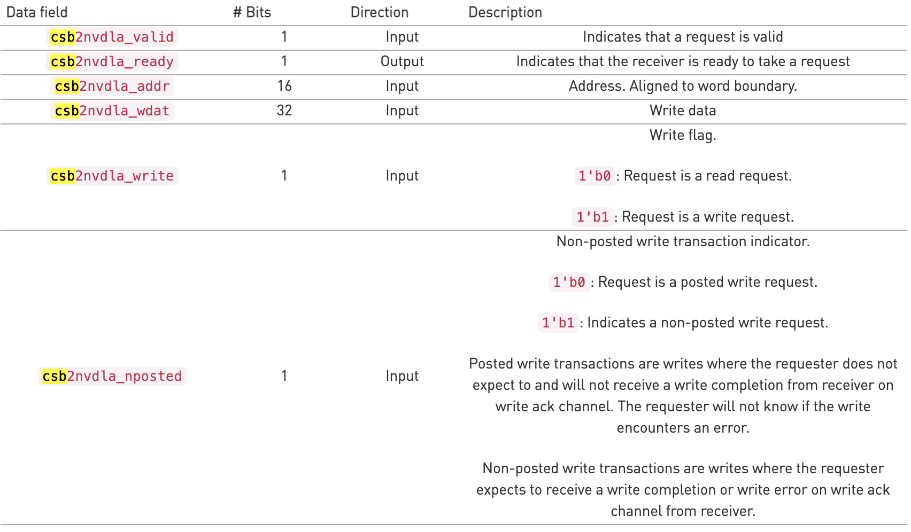
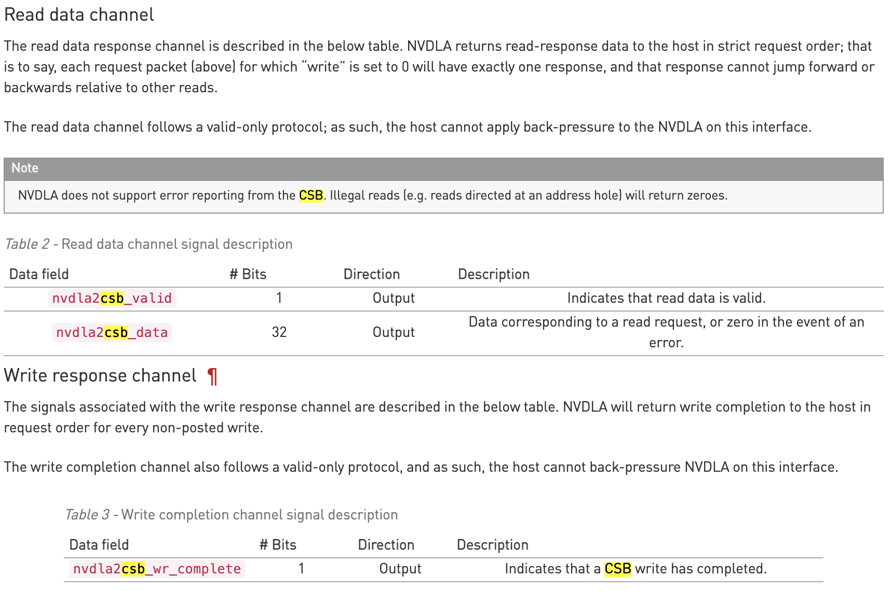
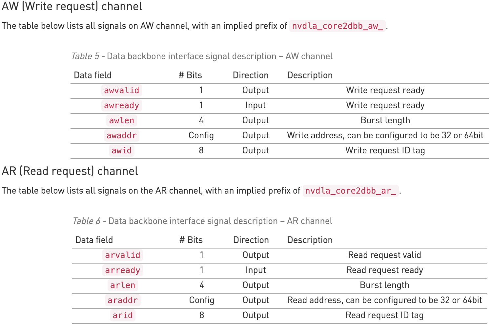
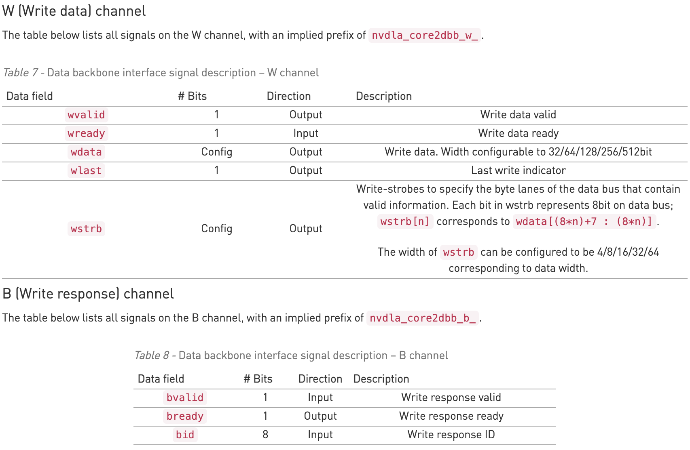

# 2D Convolution important processors in NVDLA
Based on http://nvdla.org/hw/v1/hwarch.html

## Single Datapoint Processor (SDP)
ILA already exists: https://github.com/djapp18/NVDLA_SDP
Apply both linear (scaling, normalisation, addition) and non-linear functions (ReLu, Sigmoid, Hyperbolic tangent) onto individual data points. Normally after CNN operation

## Planar Data Processor (PDP)
Spatial operations that are common in CNN applications (max-pool, min-pool, avg-pool = operator on pooling window)
Has dedicated memory interface to fetch input data from memory and outputs directly to memory

# Memory interfaces
CSB - Configuration space bus - used to set/ read config registers. A set of CSB space dedicated for SDP and a separate register for 'done' so ping pongs. Each request to CSB has a fixed request size of 32 bits of data, and has a fixed 16bit address size. Left col shows request (write/ read) params, right col shows returned result for writes and reads.

  
   

DBBIF - Data backbone for loading params and datasets. Writes must always be acknowledged, reads must always get return data. Configurable data bus width of 32, 64, 128, 256 or 512-bits. core2dbb is prefix. Left = General request format, Right = write channel specifics + write response, Read not shown, but same as write but use r not w and replace wstrb by rid (read response id).

  
   

## Programming CDMA (from docs)
1. After reset, both group 0 and group 1 are in an idle state. The CPU should read the `CDMA_POINTER` register, and set `PRODUCER` to the value of `CONSUMER`. (After reset, `CONSUMER` is expected to be `0`.)
2. The CPU programs the parameters for the first hardware layer into register group 0. After configuration completes, the CPU sets the `enable bit` in the `D_OP_ENABLE` register.
3. Hardware begins processing the first hardware layer.
4. The CPU reads the `S_STATUS` register to ensure that register group 1 is `idle`.
5. The CPU sets `PRODUCER` to `1` and begins programming the parameters for the second hardware layer into group 1. After those registers are programmed, it sets the enable bit in group 1’s `D_OP_ENABLE`.
6. The CPU checks the status of the register group 0 by reading `S_STATUS`; if it is still executing, the CPU waits for an interrupt.
7. Hardware finishes the processing of the current hardware layer. Upon doing so, it sets the status of the previously active group to idle in the `S_STATUS` register, and clears the enable bit of the `D_OP_ENABLE` register.
8. Hardware advances the `CONSUMER` field to the next register group (in this case, group 1). After advancing the `CONSUMER` field, it determines whether the enable bit is set on the new group. If so, it begins processing the next hardware layer immediately; if not, hardware waits until the enable bit is set.
9. Hardware asserts the `“done”` interrupt for the previous hardware layer. If the CPU was blocked waiting for a `“done”` interrupt, it now proceeds programming, as above.
10. Repeat, as needed.

## Equivalent for SDP:
### Programming:
1. After reset, both group 0 and group 1 are in an idle state. The CPU should read the `S_POINTER` register (`0xb004`), containing `PRODUCER` (register of pair accessed from the CSB interface) and `CONSUMER` fields (register of pair accessed by datapath for computation). and set `PRODUCER` to the value of `CONSUMER`. (After reset, `CONSUMER` is expected to be `0`.)
2. The CPU programs the parameters for the first hardware layer into register group `PRODUCER`. After configuration completes, the CPU sets the `enable bit` in the `D_OP_ENABLE` register (0xb038).
3. Hardware begins processing.
4. (DONT DO AS HANDLED BY OTHER LAYER?) The CPU reads the `S_STATUS` register to ensure that other register group to `PRODUCER` group is `idle`.
5. The CPU sets `PRODUCER` to `1` and begins programming the parameters for the second hardware layer into group 1. After those registers are programmed, it sets the enable bit in group 1’s `D_OP_ENABLE`.
6. (DONT DO AS HANDLED BY OTHER LAYER?) The CPU checks the status of the register group 0 by reading `S_STATUS`; if it is still executing, the CPU waits for an interrupt.
7. Hardware finishes the processing of the current hardware layer. Sets `CONSUMER` group (group 0) to idle in the `S_STATUS` register, and clears the enable bit of the `D_OP_ENABLE`.
8. Hardware automatically advances the `CONSUMER` field to the next register group (in this case, group 1). After advancing the `CONSUMER` field, it determines whether the enable bit is set on the new group. If so, it begins processing the next hardware layer immediately; if not, hardware waits until the enable bit is set.
9. Hardware asserts the `“done”` interrupt for the previous hardware layer. If the CPU was blocked waiting for a `“done”` interrupt, it now proceeds programming, as above.
10. Repeat, as needed.
### Registers:
| Name                           | Address | Description                                                                                                                  |
|--------------------------------|---------|------------------------------------------------------------------------------------------------------------------------------|
| S_STATUS                       | `0xb000`  | Idle status of two register groups                                                                                           |
| S_POINTER                      | `0xb004`  | Pointer for CSB master and data path to access groups                                                                        |
| S_LUT_ACCESS_CFG               | `0xb008`  | LUT access address and type                                                                                                  |
| S_LUT_ACCESS_DATA              | `0xb00c`  | Data register of read or write LUT                                                                                           |
| S_LUT_CFG                      | `0xb010`  | LUT’s type: exponent or linear. And the selection between LE and LO tables.                                                  |
| S_LUT_INFO                     | `0xb014`  | LE and LO LUT index offset and selection                                                                                     |
| S_LUT_LE_START                 | `0xb018`  | Start of LE LUT’s range                                                                                                      |
| S_LUT_LE_END                   | `0xb01c`  | End of LE LUT’s range                                                                                                        |
| S_LUT_LO_START                 | `0xb020`  | Start of LO LUT’s range                                                                                                      |
| S_LUT_LO_END                   | `0xb024`  | End of LO LUT’s range                                                                                                        |
| S_LUT_LE_SLOPE_SCALE           | `0xb028`  | Slope scale parameter for LE LUT underflow and overflow, signed value                                                        |
| S_LUT_LE_SLOPE_SHIFT           | `0xb02c`  | Slope shift parameter for LE_LUT underflow and overflow, signed value                                                        |
| S_LUT_LO_SLOPE_SCALE           | `0xb030`  | Slope scale parameter for LO LUT underflow and overflow, signed value                                                        |
| S_LUT_LO_SLOPE_SHIFT           | `0xb034`  | Slope shift parameter for LO_LUT underflow and overflow, signed value                                                        |
| D_OP_ENABLE                    | `0xb038`  | Set it to 1 to kick off operation for current register group                                                                 |
| D_DATA_CUBE_WIDTH              | `0xb03c`  | Input cube’s width                                                                                                           |
| D_DATA_CUBE_HEIGHT             | `0xb040`  | Input cube’s height                                                                                                          |
| D_DATA_CUBE_CHANNEL            | `0xb044`  | Input cube’s channel                                                                                                         |
| D_DST_BASE_ADDR_LOW            | `0xb048`  | Lower 32bits of output data address                                                                                          |
| D_DST_BASE_ADDR_HIGH           | `0xb04c`  | Higher 32bits of output data address when axi awaddr is 64bits                                                               |
| D_DST_LINE_STRIDE              | `0xb050`  | Line stride of output data cube                                                                                              |
| D_DST_SURFACE_STRIDE           | `0xb054`  | Surface stride of output data cube                                                                                           |
| D_DP_BS_CFG                    | `0xb058`  | Configurations of BS module: bypass, algorithm, etc.                                                                         |
| D_DP_BS_ALU_CFG                | `0xb05c`  | Source type and shifter value of BS ALU                                                                                      |
| D_DP_BS_ALU_SRC_VALUE          | `0xb060`  | Operand value of BS ALU                                                                                                      |
| D_DP_BS_MUL_CFG                | `0xb064`  | Source type and shifter value of BS MUL                                                                                      |
| D_DP_BS_MUL_SRC_VALUE          | `0xb068`  | Operand value of BS MUL                                                                                                      |
| D_DP_BN_CFG                    | `0xb06c`  | Configurations of BN module: bypass, algorithm, etc.                                                                         |
| D_DP_BN_ALU_CFG                | `0xb070`  | Source type and shifter value of BN ALU                                                                                      |
| D_DP_BN_ALU_SRC_VALUE          | `0xb074`  | Operand value of BN ALU                                                                                                      |
| D_DP_BN_MUL_CFG                | `0xb078`  | Source type and shifter value of BN MUL                                                                                      |
| D_DP_BN_MUL_SRC_VALUE          | `0xb07c`  | Operand value of BN MUL                                                                                                      |
| D_DP_EW_CFG                    | `0xb080`  | Configurations of EW module: bypass, algorithm, etc.                                                                         |
| D_DP_EW_ALU_CFG                | `0xb084`  | Source type and bypass control of EW ALU                                                                                     |
| D_DP_EW_ALU_SRC_VALUE          | `0xb088`  | Operand value of EW ALU                                                                                                      |
| D_DP_EW_ALU_CVT_OFFSET_VALUE   | `0xb08c`  | Converter offset of EW ALU                                                                                                   |
| D_DP_EW_ALU_CVT_SCALE_VALUE    | `0xb090`  | Converter scale of EW ALU                                                                                                    |
| D_DP_EW_ALU_CVT_TRUNCATE_VALUE | `0xb094`  | Converter truncate of EW ALU                                                                                                 |
| D_DP_EW_MUL_CFG                | `0xb098`  | Source type and bypass control of EW MUL                                                                                     |
| D_DP_EW_MUL_SRC_VALUE          | `0xb09c`  | Operand value of EW MUL                                                                                                      |
| D_DP_EW_MUL_CVT_OFFSET_VALUE   | `0xb0a0`  | Converter offset of EW MUL                                                                                                   |
| D_DP_EW_MUL_CVT_SCALE_VALUE    | `0xb0a4`  | Converter scale of EW MUL                                                                                                    |
| D_DP_EW_MUL_CVT_TRUNCATE_VALUE | `0xb0a8`  | Converter truncate of EW MUL                                                                                                 |
| D_DP_EW_TRUNCATE_VALUE         | `0xb0ac`  | Truncate of EW                                                                                                               |
| D_FEATURE_MODE_CFG             | `0xb0b0`  | Operation configuration: flying mode, output destination, Direct or Winograd mode, flush NaN to zero, batch number.          |
| D_DST_DMA_CFG                  | `0xb0b4`  | Destination RAM type                                                                                                         |
| D_DST_BATCH_STRIDE             | `0xb0b8`  | Stride of output cubes in batch mode                                                                                         |
| D_DATA_FORMAT                  | `0xb0bc`  | Data precision                                                                                                               |
| D_CVT_OFFSET                   | `0xb0c0`  | Output converter offset                                                                                                      |
| D_CVT_SCALE                    | `0xb0c4`  | Output converter scale                                                                                                       |
| D_CVT_SHIFT                    | `0xb0c8`  | Output converter shifter value                                                                                               |
| D_STATUS                       | `0xb0cc`  | Output of equal mode                                                                                                         |
| D_STATUS_NAN_INPUT_NUM         | `0xb0d0`  | Input NaN element number                                                                                                     |
| D_STATUS_INF_INPUT_NUM         | `0xb0d4`  | Input Infinity element number                                                                                                |
| D_STATUS_NAN_OUTPUT_NUM        | `0xb0d8`  | Output NaN element number                                                                                                    |
| D_PERF_ENABLE                  | `0xb0dc`  | Enable/Disable performance counting                                                                                          |
| D_PERF_WDMA_WRITE_STALL        | `0xb0e0`  | Count stall cycles of write DMA for one layer                                                                                |
| D_PERF_LUT_UFLOW               | `0xb0e4`  | Element number of both table underflow                                                                                       |
| D_PERF_LUT_OFLOW               | `0xb0e8`  | Element number of both table overflow                                                                                        |
| D_PERF_OUT_SATURATION          | `0xb0ec`  | Element number of both table saturation                                                                                      |
| D_PERF_LUT_HYBRID              | `0xb0f0`  | Element number of both hit, or both miss situation that element underflow one table and at the same time overflow the other. |
| D_PERF_LUT_LE_HIT              | `0xb0f4`  | Element number of only LE table hit                                                                                          |
| D_PERF_LUT_LO_HIT              | `0xb0f8`  | Element number of only LO table hit                                                                                          |

## PDP:
### Programming
Same as for SDP
### Registers for PDP:
| Name                          | Address | Description                                                                                                                                                              |
|-------------------------------|---------|--------------------------------------------------------------------------------------------------------------------------------------------------------------------------|
| S_STATUS                      | `0xd000`  | Idle status of two register groups                                                                                                                                       |
| S_POINTER                     | `0xd004`  | Pointer for CSB master and data path to access groups                                                                                                                    |
| D_OP_ENABLE                   | `0xd008`  | Set it to 1 to kick off operation for current register group                                                                                                             |
| D_DATA_CUBE_IN_WIDTH          | `0xd00c`  | Input data cube’s width                                                                                                                                                  |
| D_DATA_CUBE_IN_HEIGHT         | `0xd010`  | Input data cube’s height                                                                                                                                                 |
| D_DATA_CUBE_IN_CHANNEL        | `0xd014`  | Input data cube’s channel                                                                                                                                                |
| D_DATA_CUBE_OUT_WIDTH         | `0xd018`  | Output data cube’s width                                                                                                                                                 |
| D_DATA_CUBE_OUT_HEIGHT        | `0xd01c`  | Output data cube’s height                                                                                                                                                |
| D_DATA_CUBE_OUT_CHANNEL       | `0xd020`  | Output data cube’s channel                                                                                                                                               |
| D_OPERATION_MODE_CFG          | `0xd024`  | Split number                                                                                                                                                             |
| D_NAN_FLUSH_TO_ZERO           | `0xd028`  | Option to flush input NaN to zero                                                                                                                                        |
| D_PARTIAL_WIDTH_IN            | `0xd02c`  | Partial width for first, last and middle partitions of input cube                                                                                                        |
| D_PARTIAL_WIDTH_OUT           | `0xd030`  | Partial width for first, last and middle partitions of output cube                                                                                                       |
| D_POOLING_KERNEL_CFG          | `0xd034`  | Kernel width and kernel stride                                                                                                                                           |
| D_RECIP_KERNEL_WIDTH          | `0xd038`  | Reciprocal of pooling kernel width, set to actual value * (2^16) when INT8/INT16 format enabled. and set to actual value for fp16 precision mode with fp17 data format.  |
| D_RECIP_KERNEL_HEIGHT         | `0xd03c`  | Reciprocal of pooling kernel height, set to actual value * (2^16) when INT8/INT16 format enabled. and set to actual value for fp16 precision mode with fp17 data format. |
| D_POOLING_PADDING_CFG         | `0xd040`  | Left/right/top/bottom padding size                                                                                                                                       |
| D_POOLING_PADDING_VALUE_1_CFG | `0xd044`  | Padding_value*1                                                                                                                                                          |
| D_POOLING_PADDING_VALUE_2_CFG | `0xd048`  | Padding_value*2                                                                                                                                                          |
| D_POOLING_PADDING_VALUE_3_CFG | `0xd04c`  | Padding_value*3                                                                                                                                                          |
| D_POOLING_PADDING_VALUE_4_CFG | `0xd050`  | Padding_value*4                                                                                                                                                          |
| D_POOLING_PADDING_VALUE_5_CFG | `0xd054`  | Padding_value*5                                                                                                                                                          |
| D_POOLING_PADDING_VALUE_6_CFG | `0xd058`  | Padding_value*6                                                                                                                                                          |
| D_POOLING_PADDING_VALUE_7_CFG | `0xd05c`  | Padding_value*7                                                                                                                                                          |
| D_SRC_BASE_ADDR_LOW           | `0xd060`  | Lower 32bits of input data address                                                                                                                                       |
| D_SRC_BASE_ADDR_HIGH          | `0xd064`  | Higher 32bits of input data address when axi araddr is 64bits                                                                                                            |
| D_SRC_LINE_STRIDE             | `0xd068`  | Line stride of input cube                                                                                                                                                |
| D_SRC_SURFACE_STRIDE          | `0xd06c`  | Surface stride of input cube                                                                                                                                             |
| D_DST_BASE_ADDR_LOW           | `0xd070`  | Lower 32bits of output data address                                                                                                                                      |
| D_DST_BASE_ADDR_HIGH          | `0xd074`  | Higher 32bits of output data address when axi awaddr is 64bits                                                                                                           |
| D_DST_LINE_STRIDE             | `0xd078`  | Line stride of output cube                                                                                                                                               |
| D_DST_SURFACE_STRIDE          | `0xd07c`  | Surface stride of output cube                                                                                                                                            |
| D_DST_RAM_CFG                 | `0xd080`  | RAM type of destination cube                                                                                                                                             |
| D_DATA_FORMAT                 | `0xd084`  | Precision of input data                                                                                                                                                  |
| D_INF_INPUT_NUM               | `0xd088`  | Input infinity element number                                                                                                                                            |
| D_NAN_INPUT_NUM               | `0xd08c`  | Input NaN element number                                                                                                                                                 |
| D_NAN_OUTPUT_NUM              | `0xd090`  | Output NaN element number                                                                                                                                                |
| D_PERF_ENABLE                 | `0xd094`  | Enable/disable performance counting                                                                                                                                      |
| D_PERF_WRITE_STALL            | `0xd098`  | Counting stalls of write requests                                                                                                                                        |

## Remaining questions
1. SDP_RDMA and PDP_RDMA are used for loading in data ... should I worry about them or are they just for SRAM loading?
2. Not sure what addresses to use for input data + how to layout the data 